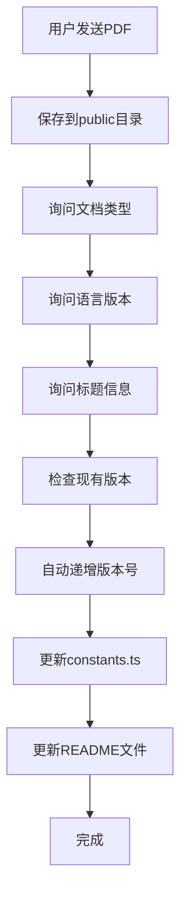

# 周永祥的简历管理 Agent 使用指南

## 简介

这是一个专门为周永祥的个人简历网站设计的智能文档管理 Agent。它可以帮助你自动化管理简历、作品集、学位证书和 Coursera 证书等文档，无需手动编辑代码文件。

## 功能特性

- **自动文件管理**：自动将 PDF 文件保存到 `public` 目录
- **智能版本控制**：自动识别当前最新版本并递增版本号
- **双语支持**：同时维护中文和英文版本的文档信息
- **代码自动更新**：自动更新 `constants.ts` 中的 `INITIAL_DOCUMENTS` 数组
- **README 同步**：自动更新 `README.md` 和 `README.en.md`
- **交互式操作**：通过简单的对话完成所有操作

## 如何使用

### 1. 启动 Agent

在 Claude Code 终端中，输入唤醒密语：

```
周永祥的简历
```

Agent 会响应并显示欢迎消息和使用说明。

### 2. 发送 PDF 文件

直接在对话中拖拽或上传你的 PDF 文件。Agent 会：
- 自动接收文件
- 将文件保存到 `C:\Users\64528\Desktop\MyResume\joe-portfolio\public` 目录
- 询问文档信息

### 3. 回答问题

Agent 会通过一系列问题来收集文档信息：

#### 问题 1：文档类型
```
这个PDF是什么类型的文档？
1. 简历 (resume)
2. 作品集 (portfolio)
3. 学位证书 (degree)
4. Coursera证书 (coursera)
```
回复对应的数字或名称。

#### 问题 2：语言版本
```
这个简历/文档是哪个语言版本？
1. 英文版
2. 中文版
3. 中英双语
```
如果是简历，通常会有中英文两个版本。

#### 问题 3-4：标题
```
请输入文档的英文标题（例如：Joe Zhou - English Resume）
请输入文档的中文标题（例如：周永祥 - 英文简历）
```

#### 问题 5-6：副标题（可选）
```
请输入英文副标题（可选，例如：Professional CV）
请输入中文副标题（可选，例如：专业版）
```
可以直接按 Enter 跳过。

#### 问题 7：版本确认
Agent 会自动检查现有版本号：
```
检测到该文档已有版本，当前最新版本是第 3 版。
是否要创建新版本？
```
回复"是"创建新版本，"否"取消。

#### 问题 8：最终确认
Agent 会显示所有信息：
```
请确认信息：
- 文档类型：简历
- 英文标题：Joe Zhou - English Resume
- 中文标题：周永祥 - 英文简历
- 版本：4
- 文件名：Joe_Zhou_Resume_En_v4.pdf

确认添加吗？(是/否)
```
回复"是"完成添加。

### 4. 自动完成

确认后，Agent 会自动：
1. 更新 `src/constants.ts` 中的 `INITIAL_DOCUMENTS` 数组
2. 更新 `README.md` 和 `README.en.md`
3. 显示完成消息

## 工作原理

Agent 执行以下操作：



## 文件结构

```
joe-portfolio/
├── .claude/
│   ├── skills/
│   │   └── resume-manager.json    # Agent 配置文件
│   └── RESUME_AGENT_README.md     # 本文档
├── public/                         # PDF 文件存储目录
│   ├── Joe_Zhou_Resume_En_v4.pdf
│   ├── Options_Analysis.pdf
│   └── ...
├── src/
│   └── constants.ts                # 自动更新的文档数据
├── README.md                       # 自动更新
└── README.en.md                    # 自动更新
```

## 示例对话

### 示例 1：添加新版本简历

```
你: 周永祥的简历

Agent: 你好！我是周永祥的简历管理助手...
(上传了 Joe_Zhou_Resume_En_v4.pdf)

Agent: 已接收文件：Joe_Zhou_Resume_En_v4.pdf
这个PDF是什么类型的文档？
1. 简历
2. 作品集
3. 学位证书
4. Coursera证书

你: 1

Agent: 这个简历是哪个语言版本？
1. 英文版
2. 中文版
3. 中英双语

你: 1

Agent: 请输入英文标题：

你: Joe Zhou - English Resume

Agent: 请输入中文标题：

你: 周永祥 - 英文简历

Agent: 请输入英文副标题（可选）：

你: Professional CV

Agent: 请输入中文副标题（可选）：

你: 专业版

Agent: 检测到英文简历已有版本，当前最新版本是第 3 版。
是否创建第 4 版？(是/否)

你: 是

Agent: 请确认信息：
- 文档类型：简历
- 英文标题：Joe Zhou - English Resume
- 中文标题：周永祥 - 英文简历
- 版本：4
- 文件名：Joe_Zhou_Resume_En_v4.pdf

确认添加吗？(是/否)

你: 是

Agent: ✅ 文档添加成功！
已更新文件：
- src/constants.ts
- README.md
- README.en.md

文件已保存到：public/Joe_Zhou_Resume_En_v4.pdf
```

### 示例 2：添加 Coursera 证书

```
你: 周永祥的简历
(上传了 Google_Data_Analytics_Cert.pdf)

Agent: 已接收文件：Google_Data_Analytics_Cert.pdf
这个PDF是什么类型的文档？

你: Coursera证书

Agent: 这个证书是哪个语言版本？

你: 3 (中英双语)

Agent: 请输入英文标题：

你: Google Data Analytics Professional Certificate

Agent: 请输入中文标题：

你: Google 数据分析专业证书

Agent: 请输入英文副标题：

你: Google / Coursera

Agent: 请输入中文副标题：

你: 机构: Google

Agent: 检测到这是新证书，将创建第 1 版。
确认添加吗？(是/否)

你: 是

Agent: ✅ 证书添加成功！
```

## 高级功能

### 手动编辑代码

如果需要手动调整文档信息，可以编辑以下文件：

**`src/constants.ts`**
- 找到 `INITIAL_DOCUMENTS` 数组
- 修改对应的分类、标题、版本等信息
- 保存后刷新网页即可看到更新

**示例结构：**
```typescript
{
  id: 'doc-resume-en',
  title: { en: "Joe Zhou - English Resume", zh: "周永祥 - 英文简历" },
  subtitle: { en: "Professional CV", zh: "专业版" },
  type: "resume",
  thumbnailUrl: "...",
  versions: [
    { version: 4, date: "2024-12-25", name: "Joe_Zhou_Resume_En_v4.pdf", size: "1.2 MB", isCurrent: true },
    { version: 3, date: "2023-11-01", name: "Joe_Zhou_Resume_En_v3.pdf", size: "1.2 MB", isCurrent: false }
  ]
}
```

### 文件命名规范

建议的文件命名格式：
- 简历：`Joe_Zhou_Resume_[En/Zh]_v{版本号}.pdf`
- 作品集：`{项目名称}_{类型}.pdf`
- 证书：`{证书名称}_Cert.pdf`

### 版本管理规则

- **简历**：每次更新创建新版本（v1, v2, v3...）
- **作品集**：通常只有一个版本，除非是重大更新
- **证书**：通常只有一个版本

## 常见问题

### Q1: 关闭终端后，Agent 还能使用吗？

**A:** 能的！Agent 的配置保存在项目中，每次打开 Claude Code 时：
1. 进入项目目录：`cd C:\Users\64528\Desktop\MyResume\joe-portfolio`
2. 启动 Claude Code
3. 输入唤醒密语："周永祥的简历"

Agent 就会被激活，所有之前的文档信息都在 `constants.ts` 中保存着。

### Q2: 如何查看当前有哪些文档？

**A:** 有几种方式：
1. 打开网站查看文档管理区域
2. 查看 `src/constants.ts` 中的 `INITIAL_DOCUMENTS`
3. 查看 `public` 目录中的 PDF 文件

### Q3: 如何删除或修改文档？

**A:** 目前需要手动编辑：
1. 打开 `src/constants.ts`
2. 找到对应的文档条目
3. 删除或修改相应的内容
4. 如果是删除，也要从 `public` 目录删除对应的 PDF 文件

### Q4: 可以添加其他类型的文档吗？

**A:** 可以！在回答问题时选择"作品集"或"其他"，Agent 会根据你的输入创建新的分类。

### Q5: 文件大小有限制吗？

**A:** 建议单个 PDF 文件不超过 10 MB，以确保网站加载速度。

## 故障排除

### 问题：Agent 没有响应唤醒密语

**解决方案：**
1. 确保在正确的项目目录中
2. 检查 `.claude/skills/resume-manager.json` 文件是否存在
3. 重新输入唤醒密语

### 问题：文件没有保存到 public 目录

**解决方案：**
1. 检查 `public` 目录的写入权限
2. 确认路径是否正确：`C:\Users\64528\Desktop\MyResume\joe-portfolio\public`
3. 手动复制文件到该目录

### 问题：代码更新后网站没有显示

**解决方案：**
1. 运行 `npm run dev` 确保开发服务器正在运行
2. 清除浏览器缓存并刷新页面
3. 检查浏览器控制台是否有错误

## 下一步

完成文档添加后：

1. **本地测试**
   ```bash
   cd C:\Users\64528\Desktop\MyResume\joe-portfolio
   npm run dev
   ```
   在浏览器中打开 http://localhost:5173 查看效果

2. **构建部署**
   ```bash
   npm run build
   ```
   将 `dist` 目录部署到你的服务器

## 技术支持

如有问题或建议，请联系：
- 姓名：周永祥 (Joe Zhou)
- 项目路径：`C:\Users\64528\Desktop\MyResume\joe-portfolio`

---

**最后更新：** 2024-12-25
**版本：** 1.0.0
